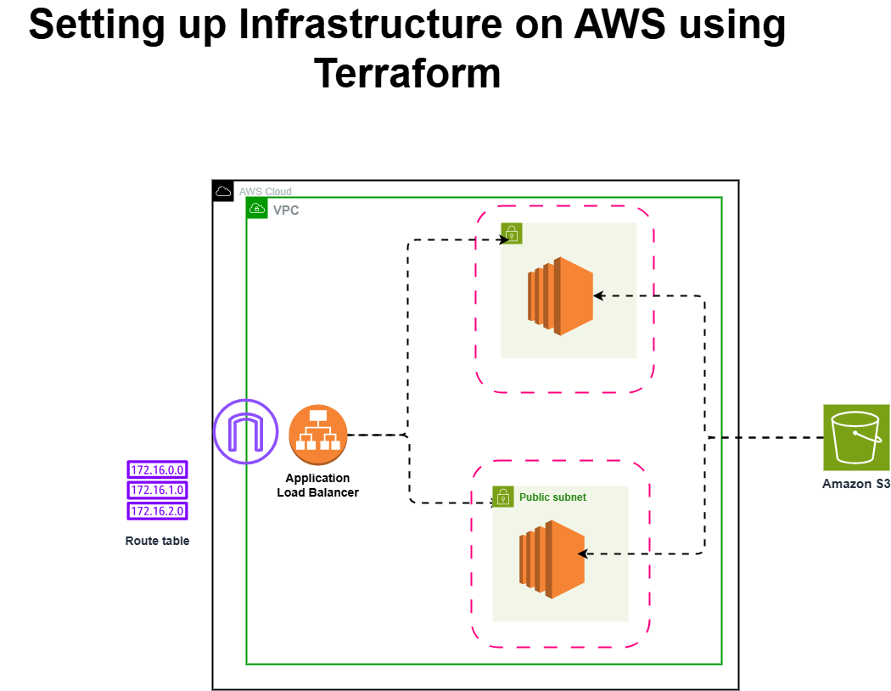

# Terraform AWS Web Infrastructure Project

## Project Overview

This project provisions a scalable web infrastructure on AWS using Terraform.

The infrastructure includes a custom VPC, public subnets across multiple availability zones, EC2 web servers, an Application Load Balancer, and an S3 bucket.

The goal of this project is to demonstrate Infrastructure as Code (IaC) using Terraform while implementing a basic highly available web architecture.

---

## Architecture

The architecture consists of:

* A custom VPC
* Two public subnets across different availability zones
* Internet Gateway for public connectivity
* Route table for internet routing
* Security group allowing HTTP and SSH access
* Two EC2 instances running Nginx web servers
* Application Load Balancer distributing traffic
* Target group performing health checks
* S3 bucket for object storage

---

## Infrastructure Components

### Networking

* VPC (`10.0.0.0/16`)
* Public Subnet 1 (`10.0.0.0/24`)
* Public Subnet 2 (`10.0.1.0/24`)
* Internet Gateway
* Route Table and Associations

### Compute

* 2 EC2 Instances (t2.micro)
* Instances configured automatically using user-data scripts

### Load Balancing

* Application Load Balancer
* Target Group
* Listener on port 80
* Health checks

### Security

* Security group allowing:

  * HTTP (port 80)
  * SSH (port 22)

### Storage

* S3 Bucket configured with public read access

---

## Tools Used

* Terraform
* AWS
* Git
* GitHub
* VS Code

---

## Deployment Steps

Initialize Terraform:

terraform init

Preview infrastructure changes:

terraform plan

Deploy infrastructure:

terraform apply

Destroy infrastructure when finished:

terraform destroy

---

## Validation

After deployment:

1. Copy the Load Balancer DNS name from the AWS console
2. Open it in a browser
3. Traffic will be distributed between the two EC2 web servers

---

## Project Structure

terraform-aws-web-infra/

main.tf
variables.tf
userdata1.sh
userdata2.sh
README.md
architecture.png

---

## Future Improvements

* Auto Scaling Group
* Private subnets
* NAT Gateway
* Terraform modules
* Remote Terraform state using S3 + DynamoDB
* CI/CD pipeline with GitHub Actions
